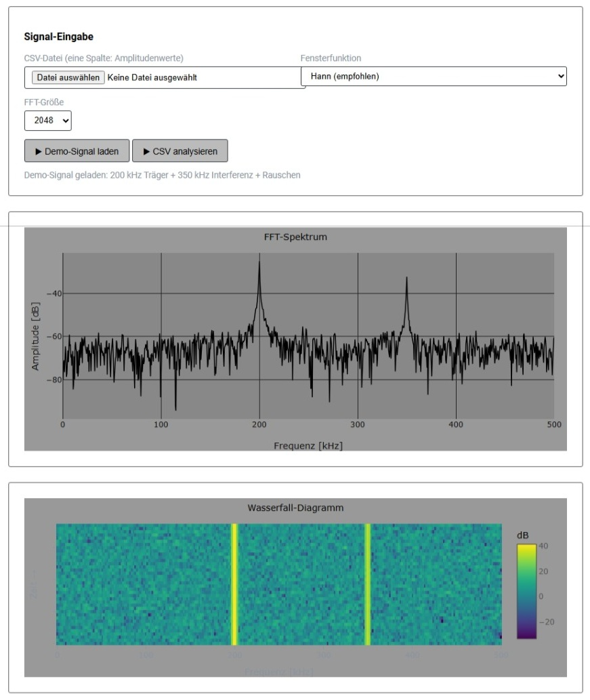
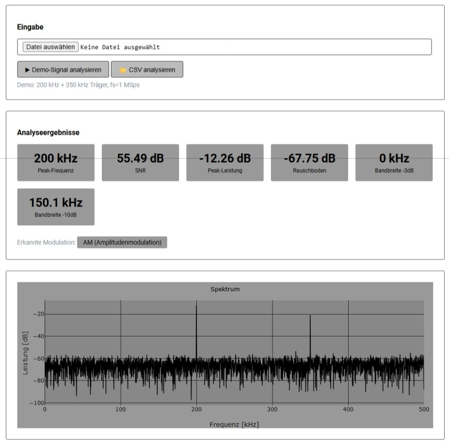
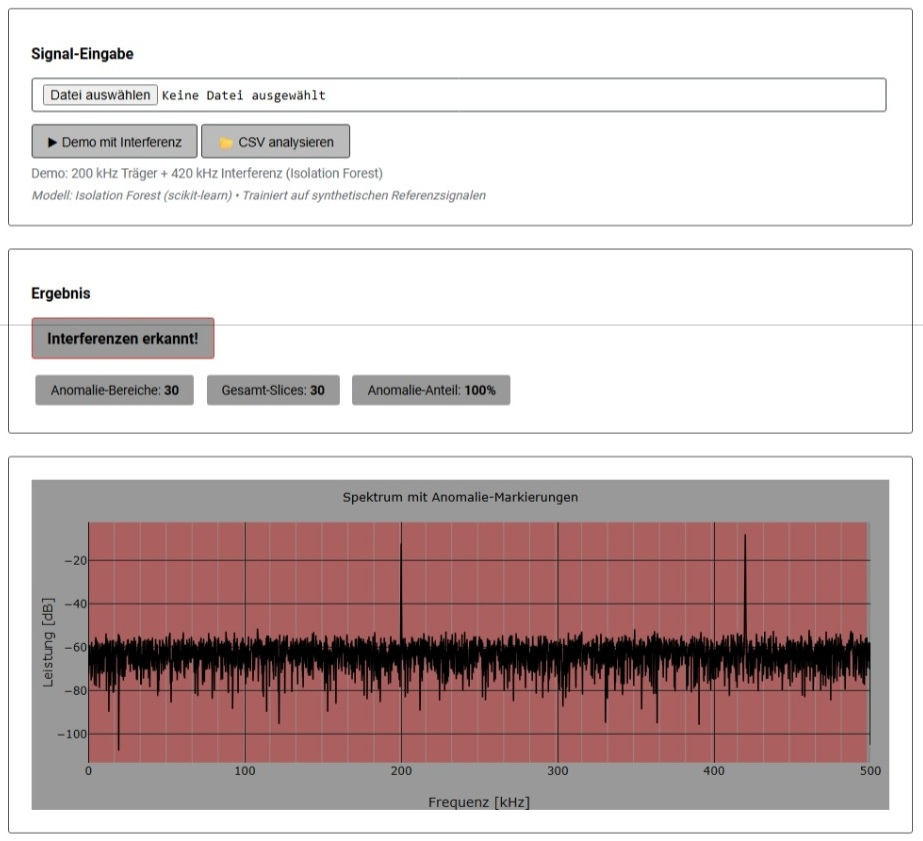
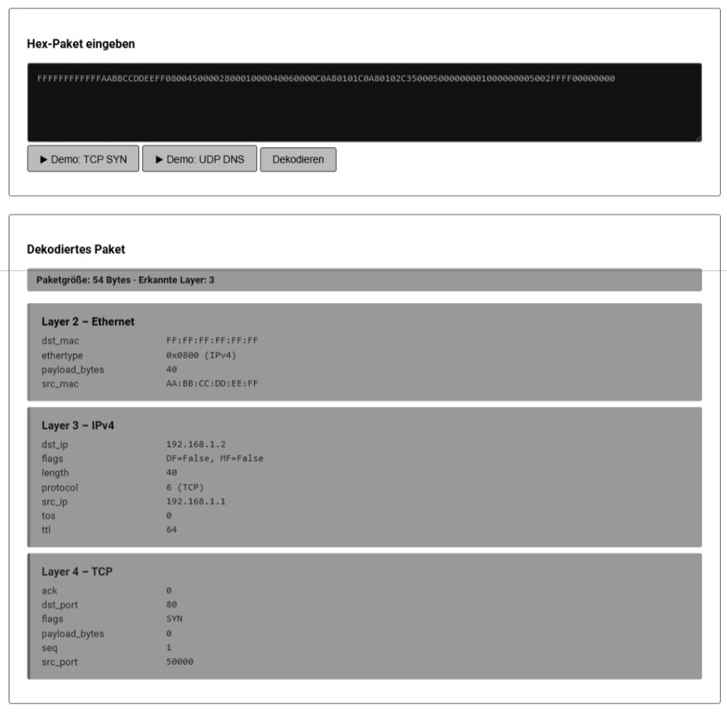
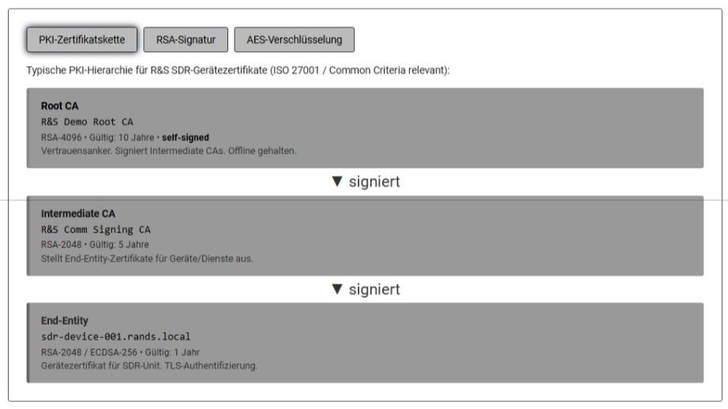
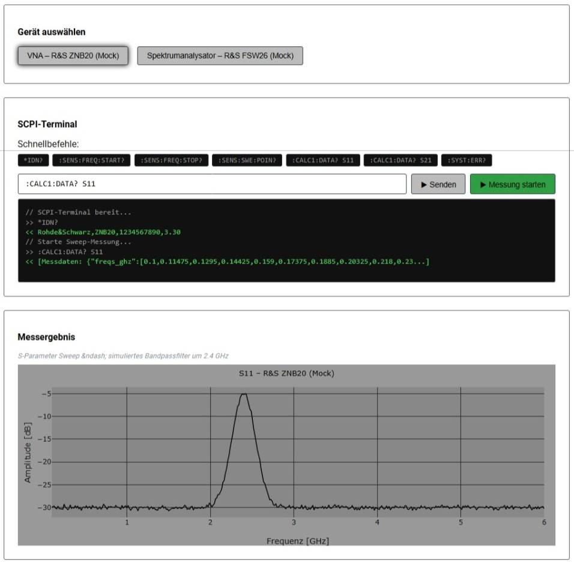
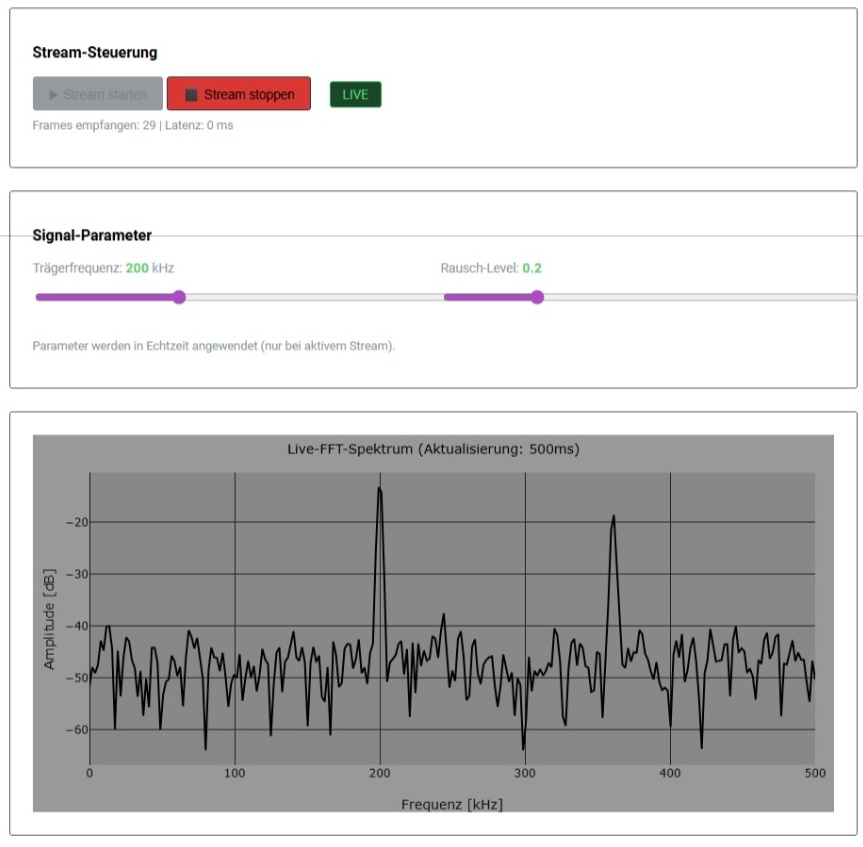
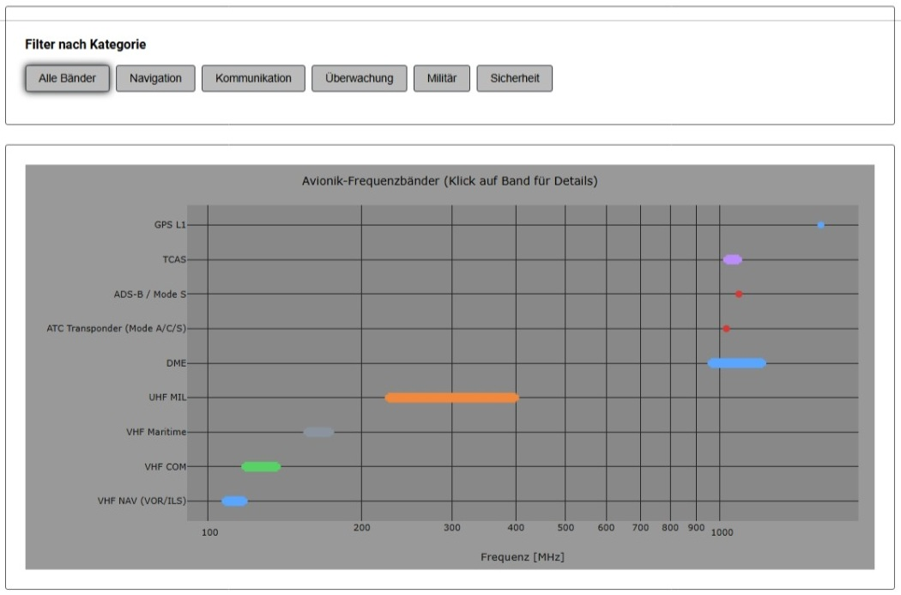

# SDR Spectrum Intelligence Dashboard

Ein webbasiertes, modulares Analyse- und Visualisierungs-Dashboard für Software Defined Radio (SDR) Daten.

> **Live Demo:** [https://rands.maazi.de](https://rands.maazi.de)

---

## Motivation

SDR Spectrum Intelligence Dashboard – mein neues End‑to‑End Analyse‑ und Visualisierungstool für Rohde & Schwarz‑nahe Messtechnik\*\*

Nach über 11 Jahren HF‑Messtechnik, RFFE‑Filtercharakterisierung und Testautomatisierung habe ich ein vollständiges, modulares SDR‑Analyse‑Dashboard entwickelt.

Das Projekt zeigt, wie ich **HF‑Domänenwissen**, **Python/Flask‑Entwicklung**, **Signalverarbeitung**, **SCPI‑Automatisierung** und **KI‑gestützte Analyse** zu einem professionellen Web‑Tool kombiniere.

**Highlights:**

- **Spektrum‑Viewer**: FFT, Wasserfall, Fensterfunktionen wie bei R&S‑FSW/FSVR [rands.maazi.de](https://rands.maazi.de)
- **Signalanalyse**: SNR, Bandbreite, Modulationserkennung (AM/FM/CW)
- **KI‑Anomalie‑Detektor**: IsolationForest erkennt Interferenzen im Spektrum
- **Protokoll‑Decoder**: OSI Layer 2/3/4 Parsing ohne externe Libraries
- **Security/PKI‑Demo**: X.509, RSA‑Signatur, AES‑Verschlüsselung
- **R&S‑SCPI‑Mock**: VNA & Spektrumanalysator‑Simulation, PyVISA‑ready
- **Echtzeit‑Signalstream**: Live‑FFT via WebSocket (500 ms Updates)
- **Avionik‑Frequenzplan**: VHF/UHF‑Bänder für ATC, NAV, Mode‑S, ADS‑B

Technologien: **Python 3.11, Flask, NumPy, SciPy, scikit‑learn, Plotly.js, cryptography, WebSockets, systemd, Plesk, Ubuntu 24**.

Das Dashboard ist vollständig produktionsbereit (HTTPS, Gunicorn, Reverse Proxy) und zeigt, wie moderne SDR‑Software aussehen kann.

---

## Projektstruktur

```
~/rands_project/
│
├── main.py                  # Flask Haupt-App, Routing zu allen Modulen
├── requirements.txt
├── README.md
│
├── 1_spectrum_viewer/       # [FERTIG] FFT & Wasserfall-Diagramm
│   ├── app.py
│   ├── templates/
│   │   ├── index.html
│   │   └── viewer.html
│   └── static/
│       ├── uploads/         # IQ/CSV-Dateien
│       └── sample_data/     # Demo-Datensätze
│
├── 2_signal_analysis/       # [FERTIG] SNR, Bandbreite, Modulationserkennung
│   ├── app.py
│   ├── templates/
│   │   ├── index.html
│   │   └── results.html
│   └── static/
│       └── plots/
│
├── 3_ai_anomaly/            # [FERTIG] KI-Anomalie-Detektor (sklearn + Plotly)
│   ├── app.py
│   ├── model/
│   │   └── anomaly_model.pkl
│   ├── templates/
│   │   └── ai_index.html
│   └── static/
│
├── 4_protocol_decoder/      # [FERTIG] OSI Layer 2/3 Demo-Decoder
│   ├── app.py
│   ├── templates/
│   │   └── proto_index.html
│   └── static/
│
├── 5_security_checker/      # [FERTIG] PKI/Kryptographie-Demo
│   ├── app.py
│   ├── templates/
│   │   └── sec_index.html
│   └── static/
│
├── 6_hw_interface/          # [FERTIG] R&S Messgeräte REST-API Stub
    ├── app.py
    ├── mock_devices/
    │   ├── vna_mock.py      # R&S ZVA/ZNB Simulator
    │   └── spectrum_mock.py # R&S FSW Simulator
    ├── templates/
    │   └── hw_index.html
    └── static/
│
├── 7_realtime_stream/       # [FERTIG] Echtzeit-Signalstream via WebSocket
│   ├── app.py
│   ├── templates/
│   │   └── stream_index.html
│   └── static/
│
└── 8_avionics_bands/        # [FERTIG] Avionik-Frequenzplan (NATO/ICAO)
    ├── app.py
    ├── templates/
    │   └── avionic_index.html
    └── static/
```

---

## Module im Detail

### Modul 1 – Spektrum-Viewer (1_spectrum_viewer)

**Status:** [erledigt] funktioniert gut

**Was es zeigt:**

- Upload von IQ-Rohdaten (CSV, .iq, .bin) oder synthetischen Demo-Signalen
- FFT-Berechnung und interaktiver Spektrum-Plot (Plotly.js)
- Wasserfall-Diagramm (Zeit-Frequenz-Darstellung)
- Einstellbare Parameter: Fensterfunktion (Hann, Hamming, Blackman), FFT-Größe, Overlap

**Technisch:**

- Backend: Python/Flask, NumPy FFT, SciPy
- Frontend: Plotly.js für interaktive Diagramme
- Demo-Daten: Synthetisches AM/FM-Signal + Rausch-Overlay

**R&S-Bezug:** Exakt die Signaldarstellung, die R&S-Messgeräte wie FSW oder FSVR liefern.
Zeigt Verständnis von Spektralanalyse und Messtechnik-Grundlagen.



---

### Modul 2 – Signalanalyse (2_signal_analysis)

**Status:** [erledigt] funktioniert gut

**Was es zeigt:**

- Automatische Berechnung von: SNR, SINAD, Rauschleistung, Signalbandbreite (-3dB, -10dB)
- Grundlegende Modulationserkennung: AM, FM, CW (regelbasiert)
- Vergleich Upload vs. Demo-Referenzsignal
- Export als CSV oder PDF-Report

**Technisch:**

- Backend: Python/Flask, NumPy, SciPy, Matplotlib/Plotly
- Frontend: Tabellarische Ergebnisdarstellung + Diagramme

**R&S-Bezug:** Entspricht den Grundfunktionen eines R&S-Signalanalysators.
Domänenwissen aus Qualcomm-Messarbeit (Filtercharakteristik, SNR-Optimierung).



---

### Modul 3 – KI-Anomalie-Detektor (3_ai_anomaly)

**Status:** [erledigt] funktioniert gut

**Was es zeigt:**

- ML-Modell (Isolation Forest / sklearn) erkennt Anomalien im Spektrum
- Visualisierung: Normale vs. anomale Spektralbereiche (farbig markiert)
- Upload eigener Spektrum-CSVs oder Demo mit synthetischen Interferenzen
- Konfidenz-Score je Anomalie

**Technisch:**

- Backend: Python/Flask, scikit-learn (IsolationForest), NumPy
- Modell wird beim ersten Start trainiert auf synthetischen Demo-Daten
- Frontend: Plotly.js mit Anomalie-Overlay

**R&S-Bezug:** KI-gestützte Testanalyse ist ein wachsendes Feld bei R&S (SDR-Testautomatisierung).
Direkte Verbindung zu "Eigeninitiativ KI-Tools entwickelt" aus Zeugnis (Qualcomm).



---

### Modul 4 – Protokoll-Decoder Demo (4_protocol_decoder)

**Status:** [erledigt] funktioniert gut

**Was es zeigt:**

- Eingabe/Upload simulierter Pakete (Hex-String oder JSON)
- Dekodierung und Darstellung der OSI-Layer 2 & 3 Felder:
  - Ethernet Frame (Layer 2): MAC-Adressen, EtherType
  - IPv4 Header (Layer 3): Source/Dest IP, TTL, Protokoll
  - Einfaches UDP/TCP-Header-Parsing (Layer 4)
- Visualisierung als Layer-Baum (interaktiv aufklappbar)

**Technisch:**

- Backend: Python/Flask, struct-Parsing (kein Scapy-Dependency)
- Frontend: Interaktiver Layer-Tree (JavaScript, kein Framework)

**R&S-Bezug:** Direkt relevant für "Softwareentwickler Protokollsoftware Avionik" (OSI 2-4 Kenntnisse).



---

### Modul 5 – Security-Checker Demo (5_security_checker)

**Status:** [erledigt] funktioniert gut

**Was es zeigt:**

- PKI-Konzept visualisiert: CA → Intermediate CA → End-Entity Zertifikat
- Demo: X.509-Zertifikat einlesen, Felder anzeigen, Gültigkeit prüfen
- Einfache Signatur-Demo: Text signieren (RSA, Python cryptography-Lib) und verifizieren
- AES-Verschlüsselung Demo: Klartext → Ciphertext → Entschlüsselung

**Technisch:**

- Backend: Python/Flask, cryptography-Bibliothek (pyca/cryptography)
- Frontend: Schritt-für-Schritt Visualisierung der kryptographischen Operationen

**R&S-Bezug:** Adressiert direkt "Software Developer Security Protocol" (PKI, Kryptographie, SmartCards).



---

### Modul 6 – Hardware-Interface Stub (6_hw_interface)

**Status:** [erledigt] funktioniert gut

**Was es zeigt:**

- REST-API-Stub simuliert R&S-Messgeräte (VNA ZVA-Klasse, Spektrumanalysator FSW-Klasse)
- Mock-Antworten im R&S SCPI-Format (Standard Commands for Programmable Instruments)
- Web-UI: Gerät auswählen, SCPI-Befehl senden, Antwort visualisieren
- Beispiel-Workflows: S-Parameter messen (S11, S21), Spektrum-Sweep starten

**Technisch:**

- Backend: Python/Flask, Mock-Klassen simulieren PyVISA/SCPI-Schnittstelle
- Erweiterbar: Echte PyVISA-Anbindung durch Austausch der Mock-Klasse
- Frontend: Terminal-artiges Interface für SCPI-Befehle

**R&S-Bezug:** Zeigt Verständnis der R&S-Messgeräte-Schnittstellen (SCPI).
Direkte Brücke zu echter Geräteintegration (Integration Engineer, Testingenieur).



---

### Modul 7 – Echtzeit-Signalstream (7_realtime_stream)

**Status:** [erledigt] funktioniert gut

**Was es zeigt:**

- Live-SDR-Spektrum via WebSocket mit 500ms Updates
- Echtzeit-FFT-Berechnung und interaktive Spektrum-Darstellung
- Dynamische Parametersteuerung (Gain, Frequenzbereich, FFT-Größe)
- WebSocket-Secure (wss://) für verschlüsselte Echtzeit-Übertragung

**Technisch:**

- Backend: Python/Flask, Flask-SocketIO, NumPy FFT
- Frontend: Plotly.js mit WebSocket-Integration für Live-Daten
- Performance: Optimiert für geringe Latenz und hohe Update-Raten

**R&S-Bezug:** Zeigt moderne Echtzeit-SDR-Technologie und WebSocket-Integration.
Direkte Anwendung für Live-Messdaten-Streaming in professionellen Umgebungen.



---

### Modul 8 – Avionik-Frequenzplan (8_avionics_bands)

**Status:** [erledigt] funktioniert gut

**Was es zeigt:**

- Interaktive Visualisierung der Avionik-Frequenzbänder (VHF/UHF)
- NATO/ICAO-konforme Frequenzpläne für ATC, NAV, Mode S, ADS-B
- Detaillierte Band-Informationen mit Frequenzbereichen und Anwendungen
- Such- und Filterfunktionen für spezifische Frequenzbereiche

**Technisch:**

- Backend: Python/Flask, JSON-Datenbank mit Avionik-Frequenzen
- Frontend: Interaktive Karte mit Plotly.js und Suchfunktionen
- Daten: Offizielle NATO/ICAO-Frequenzpläne für Luftfahrt

**R&S-Bezug:** Direkt relevant für Avionik-Messungen und Luftfahrt-Kommunikation.
Zeigt Verständnis der spezifischen Anforderungen in der Luftfahrt-Branche.



---

## Tech-Stack

| Bereich       | Technologie                                      |
| ------------- | ------------------------------------------------ |
| Backend       | Python 3.11, Flask, NumPy, SciPy, scikit-learn   |
| Frontend      | HTML5, Plotly.js, JavaScript (vanilla)           |
| Kryptographie | pyca/cryptography                                |
| Echtzeit      | Flask-SocketIO, WebSockets                       |
| Deployment    | VPS, Ubuntu 24, Plesk, systemd                   |
| Versionierung | Git, GitHub                                      |
| Signal-Demo   | Synthetische IQ-Daten (NumPy), reale CSV-Uploads |

---

## Installation & Setup

### Voraussetzungen

- Python 3.10+
- Ubuntu 20.04+ (oder lokal auf Windows mit WSL)
- Optional: VPS mit Plesk

### Lokale Installation (Hinweis an mich! Sehr Wichtiger Abschnit!)

```bash
# Repository klonen
git clone https://github.com/maazi/sdr-spectrum-dashboard
cd sdr-spectrum-dashboard

# Virtual Environment erstellen
python3 -m venv venv
source venv/bin/activate

# Virtual Environment erstellen # Windows #
python -m venv venv
.\venv\Scripts\Activate.ps1

# Abhängigkeiten installieren
pip install -r requirements.txt

# App starten
python main.py
```

Im Browser öffnen: `http://localhost:5000`

### VPS Deployment (Ubuntu + Plesk. Hinweis an mich! Sehr Wichtiger Abschnit! [ ] Docker-Deployment ist hier wichtig, offener Punkt !)

```bash

# Virtual Environment erstellen (richtig !)
python3 -m venv venv
source venv/bin/activate

### sudo Virtual Environment erstellen (Falsch !)
sudo python3 -m venv venv
source venv/bin/activate

### sudo Virtual Environment erstellen (Reparatur !)
# falls sudo Virtual Environment noch aktiv
deactivate
 rm -rf venv
 python3 -m venv venv
 source venv/bin/activate
 pip install -r requirements.txt

# Abhängigkeiten installieren
pip install -r requirements.txt

```

### Erstelle eine Datei /etc/systemd/system/rands-dashboard.service mit folgendem Inhalt (Passe ggf. die Pfade an!):

```bash
sudo nano /etc/systemd/system/rands-dashboard.service

```

### ertellen rands-dashboard.service:

```bash
[Unit]
Description=SDR Spectrum Intelligence Dashboard
After=network.target

[Service]
User=user
Group=www-data
WorkingDirectory=/var/www/rands_project
Environment="PATH=/var/www/rands_project/venv/bin"
ExecStart=/var/www/rands_project/venv/bin/python main.py

Restart=always

[Install]
WantedBy=multi-user.target
```

### Service aktivieren und starten

```bash
sudo systemctl daemon-reload
sudo systemctl enable rands-dashboard
sudo systemctl start rands-dashboard
sudo systemctl status rands-dashboard
```

### Flask’s eingebauter Server ist nicht für Produktion gedacht.

### Nutze Gunicorn (im venv installieren):

```bash
pip install gunicorn
```

### /etc/systemd/system/rands-dashboard.service mit folgendem gunicorn Inhalt anpassen:

```bash
sudo nano /etc/systemd/system/rands-dashboard.service

```

```bash
[Unit]
Description=SDR Spectrum Intelligence Dashboard
After=network.target

[Service]
User=user
Group=www-data
WorkingDirectory=/var/www/rands_project
Environment="PATH=/var/www/rands_project/venv/bin"
ExecStart=/var/www/rands_project/venv/bin/gunicorn -w 4 -b 127.0.0.1:5001 main:app

Restart=always

[Install]
WantedBy=multi-user.target
```

### Service aktivieren und starten

```bash
sudo systemctl daemon-reload
sudo systemctl enable rands-dashboard
sudo systemctl start rands-dashboard
sudo systemctl status rands-dashboard
```

### Auf meinem Domäne account die subdomäne für maazi.de angelegt "rands.maazi.de" erstellt (ssl schützen).

### In Plesk auch die subdomäne angelegt.

### In der subdomäne die Apache zusätzliche Anweisung für http und https gesetzt.

### Einstellungen für Apache & nginx für rands.maazi.de/

### Zusätzliche Anweisungen für HTTP:

```
ProxyPreserveHost On
ProxyRequests Off

Header always unset X-Frame-Options

ProxyPass / http://127.0.0.1:5001/
ProxyPassReverse / http://127.0.0.1:5001/
```

### Zusätzliche Anweisungen für HTTPS:

```
ProxyPreserveHost On
ProxyRequests Off

Header always unset X-Frame-Options

ProxyPass / http://127.0.0.1:5001/
ProxyPassReverse / http://127.0.0.1:5001/

RequestHeader set X-Forwarded-Proto "https"
```

### Testen

Rufe https://rands.maazi.de

# Oder als systemd-Service (empfohlen)

sudo systemctl start rands-dashboard

```

python main.py
Erreichbar unter: `https://rands.maazi.de`

**HTTPS-Sicherheit:**
Die Anwendung läuft über HTTPS mit SSL/TLS-Verschlüsselung (Let's Encrypt Zertifikat, automatisch via Plesk).
Dies gewährleistet:

- Verschlüsselte Datenübertragung zwischen Browser und Server
- Schutz vor Man-in-the-Middle-Angriffen
- WebSocket-Secure (wss://) für Echtzeit-Streaming
- Erfüllung moderner Security-Standards für professionelle Webanwendungen

---

## requirements.txt

```

flask>=3.0.0
numpy>=1.26.0
scipy>=1.12.0
scikit-learn>=1.4.0
plotly>=5.19.0
matplotlib>=3.8.0
pandas>=2.2.0
cryptography>=42.0.0
joblib>=1.3.0
flask-socketio>=5.3.0
eventlet>=0.33.0

```

---

## Projekt-Status & Roadmap

### Fertig (v1.0)

- [x] Modul 1: Spektrum-Viewer (FFT, Wasserfall)
- [x] Modul 2: Signalanalyse (SNR, Bandbreite)
- [x] Modul 3: KI-Anomalie-Detektor
- [x] Modul 4: Protokoll-Decoder Demo
- [x] Modul 5: Security/PKI-Demo
- [x] Modul 6: Hardware-Interface Stub (R&S SCPI Mock)

### Fertig (v1.1) – Design-Upgrade & Neue Module

- [x] **Modul 7: Echtzeit-Signalstream** – Live-SDR-Spektrum via WebSocket, 500ms Updates, interaktive Parameter
- [x] **Modul 8: Avionik-Frequenzplan** – VHF/UHF-Bänder für Navigation, ATC, Mode S, ADS-B (NATO/ICAO)
- [x] **Design-Upgrade** – Professionelles Schwarz/Weiß-Layout im maazi.de-Stil, Roboto-Font, Border-Radius 3px
- [x] **WebSocket-Integration** – Flask-SocketIO für Echtzeit-Datenstreaming
- [x] **HTTPS-Deployment** – Sichere Verbindung über SSL/TLS-Zertifikat (Let's Encrypt via Plesk)

### Geplant (v1.2)

- [ ] Echte PyVISA-Anbindung (wenn R&S-Hardware verfügbar)
- [ ] Docker-Deployment
- [ ] Authentifizierung & Multi-User-Support

---
```
